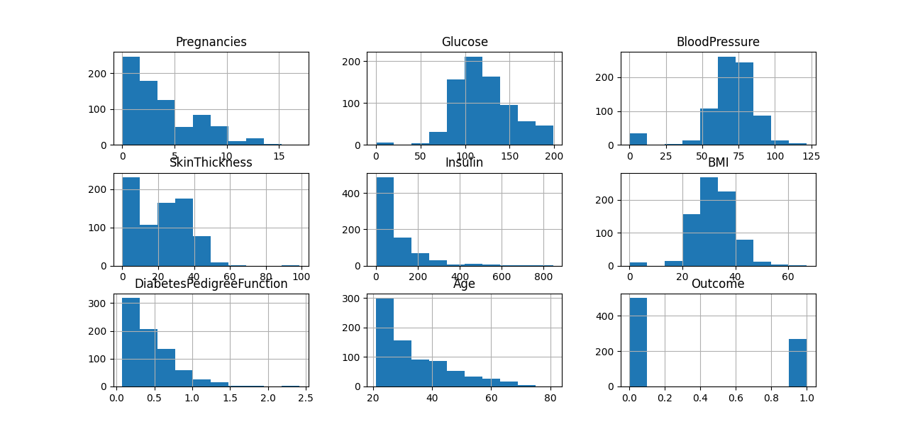

# Diabetes Prediction using Machine Learning

This project predicts whether a person is likely to have diabetes based on basic medical information using machine learning.


## Project Overview

Diabetes is a common health condition that requires early detection.  
In this project, machine learning models are trained to analyze patient data and predict the likelihood of diabetes.

The project focuses on:
- Cleaning real-world medical data
- Handling missing and incorrect values
- Comparing different machine learning models
- Saving a trained model for future predictions

## Dataset

The project uses the **PIMA Indians Diabetes Dataset**.

### Features Used:
- Pregnancies  
- Glucose  
- Blood Pressure  
- Skin Thickness  
- Insulin  
- BMI  
- Diabetes Pedigree Function  
- Age  

### Target:
- **Outcome**
  - `0` → Non-Diabetic  
  - `1` → Diabetic  

Missing or zero values are handled using **KNN Imputation**, and the data is scaled for better model performance.


## Models Used

- Random Forest  
- Extra Trees  
- Gradient Boosting  

To handle class imbalance, techniques like **SMOTE** and **SMOTEENN** were applied.


## Results

- Tree-based models performed better than basic classifiers
- Oversampling techniques improved prediction for diabetic cases
- Gradient Boosting and Random Forest showed stable and reliable performance

The trained model is saved and can be reused for predictions.



## Usage
```bash
python algorithm_comparison.py

python diabetesprediction.py
```
